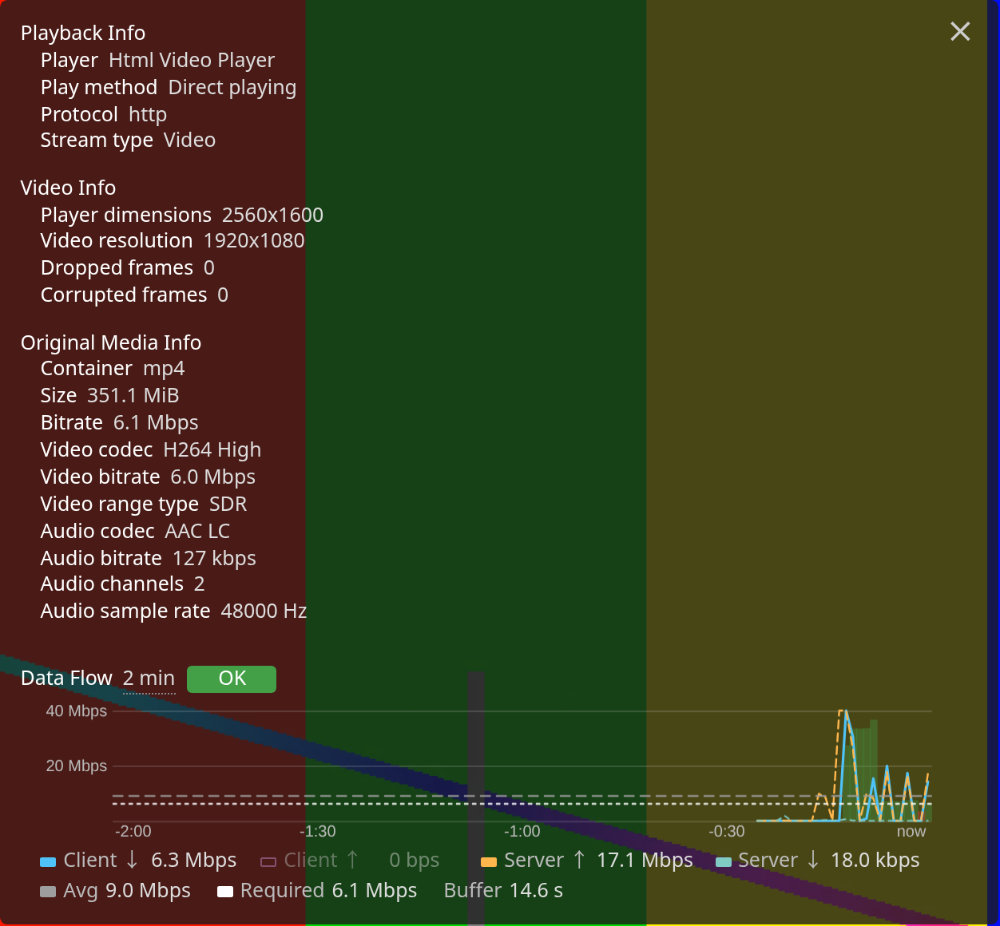
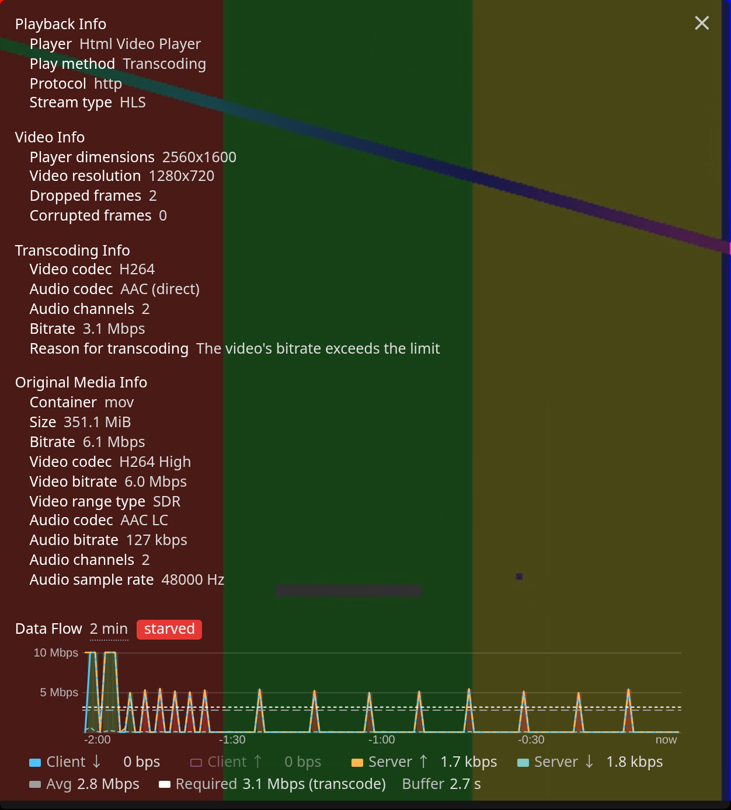

# Jellyfin Data Flow

A Jellyfin server plugin that adds a live network throughput graph to the web client's
**Playback Info** overlay: client download/upload for the current playback, server-wide
upload/download, a rolling average, and colour coding against the bitrate the video needs.



Status: v0.1 feature complete for Jellyfin 10.11.x. See [SPEC.md](SPEC.md), [PLAN.md](PLAN.md),
[docs/RESEARCH.md](docs/RESEARCH.md) and [docs/PERF.md](docs/PERF.md).

## What you get

Open any video, then open **Playback Info** from the player's settings menu. A **Data Flow**
section appears below the existing categories:

- **Graph** of the last 1, 2 or 5 minutes (click the window label to cycle). Series: client
  download (solid), client upload (thin, off by default), server upload (dashed), server
  download (dashed). Click a legend entry to toggle a series; choices are remembered.
- **Required bitrate** line: the transcode output bitrate when transcoding, otherwise the
  media source bitrate. **Average** line: mean client download over the visible window.
- **Colour coding**: the area under the 5-second mean of client download is green when it
  keeps up with the required bitrate, amber when within the configurable margin below it,
  red when starved. When the player still has a healthy buffer the badge says *buffered*
  instead of raising a false alarm during the idle gaps that HLS naturally has.
- **Legend row** with the current values, the average, the required bitrate and the buffer
  health (seconds buffered ahead of the playhead).
- **Hover tooltip** with the time and every value at that sample.



Nothing runs while the overlay is closed: no polling, no timers, no drawing.

## Install

1. Download `dataflow_<version>.zip` from the releases page, or add the repository manifest
   URL under **Dashboard > Plugins > Repositories** and install **Data Flow** from the catalog.
2. For a manual install, extract the zip into `<jellyfin data>/plugins/DataFlow_<version>/`
   and restart Jellyfin.
3. Reload the web client (the script tag is injected into `index.html` on the fly; the file on
   disk is never modified).

Settings live under **Dashboard > Plugins > Data Flow**: enable/disable injection, poll
interval, history length, marginal band, network interfaces used for the server totals, and
the browser-side measurement fallback.

## Scope and limitations

- Targets the Jellyfin **web** client (and apps that embed it). Native clients such as Android
  TV render their own stats overlay and cannot be extended by a server plugin.
- Client download is counted on the server as bytes written to the media response. If a
  reverse proxy or CDN serves media from its own cache, the server sees nothing; the browser
  then measures its own HLS segment downloads through the Resource Timing API instead
  (progressive `<video>` loads are not visible to that API).
- Per-second values are bursty by nature: HLS fetches a segment then idles, and progressive
  playback fetches in chunks. Judge throughput by the 5-second mean and the buffer health.
- Server totals come from the operating system's interface counters; in a container that is
  the container's interfaces.

## How it works

- An `IStartupFilter` registers two middlewares at the outermost position of the ASP.NET
  pipeline. One rewrites `/web/index.html` responses in flight to add the script tag. The other
  wraps the response body of media routes (`/Videos/{id}/stream…`, `/Videos/{id}/hls1/…`,
  `master.m3u8`, subtitles, and the `/Audio` equivalents) in a counting stream keyed by the
  request's `deviceId`. Request sizes are counted as client upload.
- A hosted service closes a 1-second bucket per device every second, samples the network
  interfaces, and evicts devices idle for 10 minutes. Everything stays in memory.
- `GET /DataFlow/Samples?deviceId=&since=` returns compact arrays; the client keeps a cursor
  so each poll carries only new buckets.
- The client script appends its panel as a sibling of `.playerStats-stats` inside the overlay,
  so jellyfin-web's own re-rendering leaves it alone, and observes the overlay's `hide` class to
  start and stop.

## Development

Everything runs in the VS Code devcontainer (`.devcontainer/`): a .NET 9 SDK container plus a
Jellyfin 10.11 container with `dist/plugins` mounted as its plugin directory and `media/` as a
Movies library. First run: `scripts/post-create.sh` generates synthetic test clips at known
bitrates; the Jellyfin at http://localhost:8096 is set up with user `admin` / password `admin`.

```bash
scripts/deploy.sh                      # build, copy into dist/plugins, restart Jellyfin, tail logs
dotnet test Jellyfin.Plugin.DataFlow.sln
cd scripts/e2e && npm install && npm run install-browsers
npm run e2e                            # headless Chrome: login, play, open Playback Info, screenshots
npm run e2e:hls                        # forced transcode + 0.5 Mbps throttle: buffered -> starved -> OK
node perf-client.js                    # main-thread cost with the overlay open vs closed
scripts/package.sh                     # artifacts/dataflow_<version>.zip + manifest.json
```

The e2e script uses real Chrome rather than the Playwright Chromium build because the latter
has no H.264 decoder. Chrome does not apply DevTools network throttling to `<video>` element
loads, so the throttle test forces a transcode (hls.js uses XHR, which is throttled).
